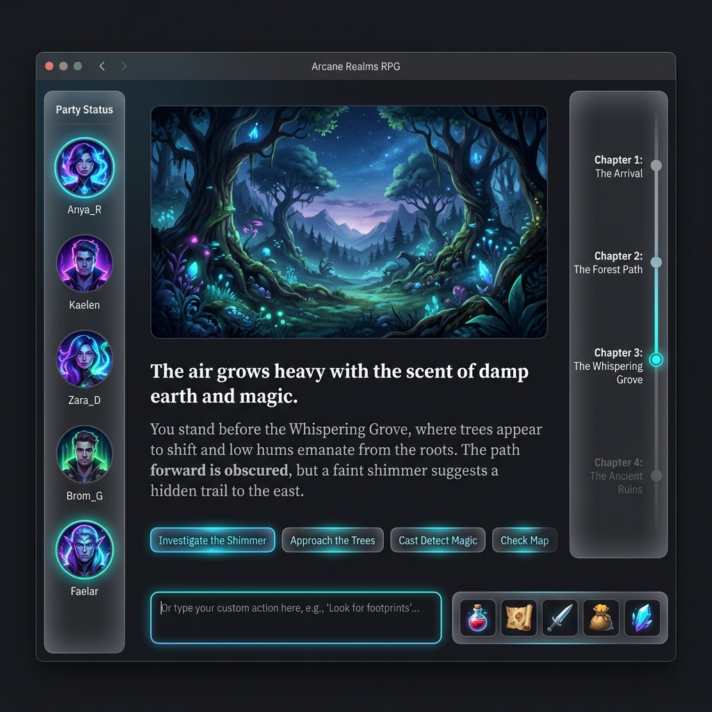

# Design Proposal: Modern DnD Quest Game

Этот документ описывает предлагаемое решение по UX-дизайну и визуальной стилистике для вашей DnD-игры, ориентированной на аудиторию 16-25 лет.

## Описание концепции

Референс, который вы предоставили, имеет классическую фэнтези-компоновку (скевоморфизм, имитация старой бумаги, золотые вензеля). Для аудитории 16-25 лет этот стиль может казаться устаревшим и тяжеловесным.

Мы предлагаем использовать стиль **Dark Mode + Glassmorphism + Neon Accents**. Это сочетает в себе атмосферу таинственности (идеально для DnD и AI-генерации) с современным, чистым и премиальным UX, который привычен поколению Z по таким играм, как Valorant, или современным веб-приложениям (Discord, Notion).

---

## 1. Визуальный стиль и Цвета

- **Фон (Background):** Глубокие темные оттенки. Например, темно-сине-серый (`#0B0F19` или `#0F172A`). Можно добавить легкий шум (noise texture) или абстрактный градиент на фоне для создания объема.
- **Панели (Panels/Cards):** Эффект матового стекла (Glassmorphism). Полупрозрачный темный фон (`rgba(255, 255, 255, 0.03)`), легкое размытие заднего фона (`backdrop-filter: blur(12px)`) и тонкая рамка (`1px solid rgba(255, 255, 255, 0.1)`).
- **Акценты (Accents):** Яркие, неоновые цвета для интерактивных элементов, обозначающие магию или энергию.
  - Основной экшен (Primary): **Neon Purple** (`#A855F7`) или **Electric Blue** (`#3B82F6`).
  - Успех/Здоровье (Success/HP): **Emerald** (`#10B981`).
  - Предупреждение/Опасность: **Rose/Crimson** (`#F43F5E`).
- **Типографика:** Отказ от шрифтов с засечками (serif). Используем современные гротески, которые легко читаются на экранах.
  - Заголовки: `Outfit` или `Space Grotesk` (геометричные, современные).
  - Наборный текст: `Inter` или `Roboto`.

---

## 2. UX Расположение главного интерфейса

Мы сохраняем логику референса, так как она удобна, но "облегчаем" её визуально:

### Левый сайдбар (Игроки и Мастер)

- **Было:** Тяжелые блоки с рамками, иконки классов.
- **Станет:** Плавающая "стеклянная" панель. Аватары игроков в идеальных кругах или гексагонах с легким свечением. Индикаторы здоровья и маны в виде тонких, ярких линий (progress bars) под именем.
- Убираем лишние декоративные линии. Оставляем только важную статистику (Уровень, Класс) чистым текстом.

### Центральная зона (Сюжет и ИИ)

Это главное окно фокуса.

- **Изображение локации:** Картинка, сгенерированная ИИ, занимает широкую область сверху. Края картинки можно сделать слегка скругленными (border-radius: 16px) с плавным затуханием (fade) внизу в цвет фона, чтобы она бесшовно переходила в текст.
- **Текст истории:** Чистый, легко читаемый текст. Важные имена или предметы можно выделять акцентным цветом.
- **Зона действий (Кнопки решений и Инвентарь):** 
  - **Предопределенные варианты:** Кнопки крупные, минималистичные, с эффектом свечения (glow) при наведении.
  - **Свой вариант:** Поле ввода (Text Input) под основными кнопками. Игрок может вручную написать любое действие (например, "Использую факел, чтобы поджечь паутину") и отправить ИИ.
  - **Использование инвентаря:** Специальная кнопка "Инвентарь" (или панель быстрого доступа к предметам - hotbar). При открытии инвентаря показывается плавающий Glassmorphism-оверлей поверх нижней части экрана, чтобы можно было выбрать предмет для взаимодействия в текущей сцене.

### Правый сайдбар (Таймлайн / История)

- **Было:** Список свитков.
- **Станет:** Минималистичный вертикальный таймлайн. Линия с точками (нодами) глав. Активная глава светится неоном. При наведении на старую главу появляется аккуратный тултип с её названием.

### Верхняя панель (Top Bar)

- Плавающая панель с показателями ресурсов (например, Золото) и глобальными кнопками ("Журнал", "Инвентарь", "Саммари партии").

---

## User Review Required

> [!IMPORTANT]
> Я также сгенерировал визуальный мокап (концепт) интерфейса с помощью ИИ. Посмотрите его выше в нашем чате (или в директории артефактов).
>
> Устраивает ли вас такой вектор развития (Dark Mode + Glassmorphism)?
> Нужно ли сделать акцент на какой-то конкретный жанр фэнтези (темное фэнтези, киберпанк, стимпанк) или оставляем классическое фэнтези, но в современной обертке?

## Open Questions

1. Какой фреймворк вы используете для frontend (я вижу в проекте папку frontend, это React/Next.js/Vue)?
2. Будут ли у нас использоваться какие-то UI-библиотеки или мы будем писать стили с нуля (Vanilla CSS / Tailwind)? У вас открыт файл `theme.css`.
